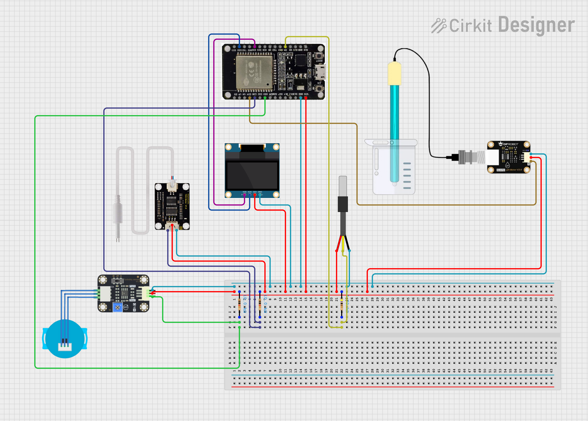

# 💧 Real-Time Water Quality Monitor Using ESP32 with Local Server & Firebase

An IoT-based smart water quality monitoring system using an **ESP32** and multiple analog/digital sensors to measure **pH**, **TDS**, **turbidity**, and **temperature**. The sensor data is uploaded to **Firebase Realtime Database** and visualized on a live **Python Flask dashboard**.



---

## 🚀 Features

- 📡 Real-time sensor data updates to Firebase
- 📊 Live Flask web dashboard for monitoring
- 🧪 pH, TDS, turbidity & temperature readings
- 💾 Data display on OLED screen
- 🔌 Built using ESP32 for Wi-Fi and multi-sensor support

---

## 🧰 Hardware Required

| Component            | Quantity |
|----------------------|----------|
| ESP32 Dev Board      | 1        |
| pH Sensor Module     | 1        |
| TDS Sensor Module    | 1        |
| Turbidity Sensor     | 1        |
| DS18B20 Temp Sensor  | 1        |
| OLED Display (I2C)   | 1        |
| 4.7kΩ Resistor       | 1        |
| Breadboard + Jumper  | as needed |

---

## 🔌 Circuit Diagram

> The following diagram shows how each sensor and display module connects to the ESP32:

📷 **[circuit.png]** – stored in the repo, displays full schematic (uploaded already).

---

## 🔧 Pin Configuration (ESP32)

| Sensor/Module     | GPIO Pin   |
|-------------------|------------|
| pH Sensor         | GPIO32     |
| TDS Sensor        | GPIO35     |
| Turbidity Sensor  | GPIO34     |
| DS18B20 Temp      | GPIO27     |
| OLED SDA          | GPIO21     |
| OLED SCL          | GPIO22     |

---

## ☁️ Firebase Setup

1. Create a Firebase project at [firebase.google.com](https://console.firebase.google.com)
2. Enable **Realtime Database** and set rules to public or authenticated (for testing):
   ```json
   {
     "rules": {
       ".read": true,
       ".write": true
     }
   }

## 🐍 Flask Dashboard

Install dependencies:

bash
pip install flask firebase-admin
Add your serviceAccountKey.json (Firebase Admin SDK) to the project root.

Run the app:

bash

python app.py
Access the dashboard in your browser at http://localhost:5000

## 🧪 Sensor Calibration Tips

pH: Use buffer solutions (pH 4.00, 7.00, 10.00) for accurate mapping.

TDS: Test with known solutions (e.g., 500 ppm water).

Turbidity: Check with clear and cloudy water to set thresholds.

DS18B20: Should be plug-n-play accurate.

## 📂 Project Structure

water-quality-monitor/
├── Water Quality Monitor Updated Diagram.png
├── esp32-code/
│   └── water_monitor.ino
├── flask-dashboard/
│   ├── app.py
│   ├── templates/
│   │   └── index.html
│   └── static/
│       └── style.css
└── README.md

## 🤖 Built By

Made with 💡 by T. M. Mehrab Hasan — Turning water into data one drop at a time.
